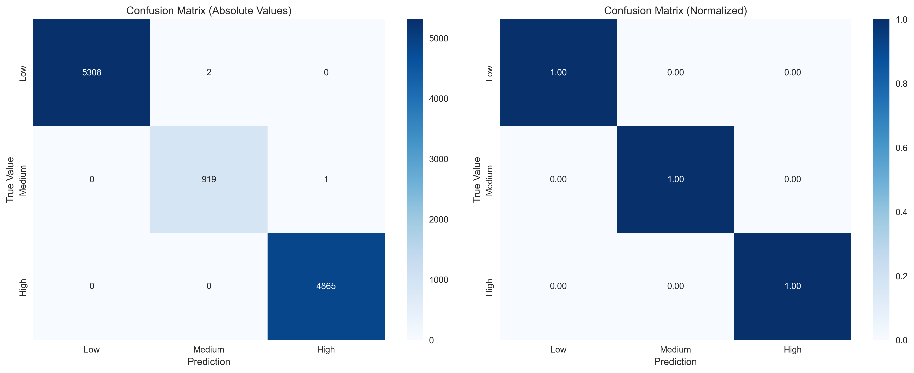

# Contaminant Transport Modeling with Machine Learning :ocean:

<div align="center">

[](https://github.com/gstinoco/contaminant-transport-ml) [](https://www.python.org/downloads/) [](https://numpy.org/) [](https://scikit-learn.org/) [](https://matplotlib.org/) [](https://opensource.org/licenses/MIT)

**Advanced Computational Framework for Contaminant Transport and Ecological Risk Assessment**

*Integrating numerical modeling with machine learning for environmental contamination analysis*

### :link: Quick Links
[](#rocket-quick-start) [](#chart_with_upwards_trend-results-and-performance) [](#movie_camera-visualizations--demos) [](#scientist-research-team)

</div>

---

## :clipboard: Table of Contents
- [Overview](#star2-overview)
- [Features](#sparkles-features)
- [Installation & Setup](#package-installation--setup)
- [Quick Start](#rocket-quick-start)
- [Visualizations & Demos](#movie_camera-visualizations--demos)
- [Project Architecture](#open_file_folder-project-architecture)
- [Programming Examples](#programming-examples)
- [Configuration](#gear-configuration)
- [Results and Performance](#chart_with_upwards_trend-results-and-performance)
- [Scientific Background](#books-scientific-background)
- [Research Team](#scientist-research-team)
- [Citation & License](#memo-citation)
- [Contact](#email-contact--support)

---

## :star2: Overview

This repository presents a **state-of-the-art computational framework** that combines numerical modeling of contaminant transport with machine learning techniques to predict ecological risk levels in aquatic environments. The system integrates a 2D advection-diffusion model with advanced ML algorithms to provide comprehensive risk assessment capabilities for environmental contamination scenarios.

### :gear: Key Capabilities
- **:ocean: Numerical Simulation**: 2D advection-diffusion equation solver with customizable boundary conditions
- **:robot: Machine Learning**: Multi-algorithm risk classification (Random Forest, SVM, Gradient Boosting, Logistic Regression)
- **:warning: Risk Assessment**: Automated ecological risk level classification (Low, Medium, High)
- **:art: Visualization**: Comprehensive plotting, animations, and interactive dashboards
- **:microscope: Scenario Analysis**: 33 predefined hydrodynamic scenarios for comprehensive testing

### :microscope: Applications

| Field | Application | Use Case |
|-------|-------------|----------|
| **Environmental Engineering** :herb: | Pollution Assessment | Contaminant plume modeling, risk zone identification |
| **Aquatic Ecology** :fish: | Ecosystem Protection | Species impact assessment, habitat risk evaluation |
| **Water Resources** :droplet: | Management Planning | Contamination source control, remediation strategies |
| **Regulatory Compliance** :clipboard: | Environmental Monitoring | Risk threshold validation, compliance reporting |
| **Research & Development** :microscope: | Scientific Studies | Model validation, methodology development |

---

## :sparkles: Features

### :abacus: Numerical Modeling
- **2D Advection-Diffusion Solver**: Finite difference implementation with adaptive time stepping
- **Flexible Boundary Conditions**: Dirichlet, Neumann, and mixed boundary types
- **Source Term Modeling**: Point and distributed contaminant sources with temporal control
- **Physical Processes**: Advection, diffusion, and first-order decay mechanisms

### :robot: Machine Learning
- **Multi-Algorithm Support**: Random Forest, SVM, Gradient Boosting, Logistic Regression
- **Feature Engineering**: 16 comprehensive features (8 fundamental + 8 derived)
- **Hyperparameter Optimization**: Automated GridSearchCV with cross-validation
- **Performance Metrics**: Accuracy, Precision, Recall, F1-Score (macro and weighted)

### :bar_chart: Visualization & Analysis
- **Concentration Field Plots**: Static and animated concentration distributions
- **Risk Level Mapping**: Color-coded risk classification visualization
- **Model Comparison**: Performance dashboards and confusion matrices
- **Temporal Evolution**: Video generation for concentration dynamics
- **Feature Importance**: Analysis of predictive variable significance

### :dart: Risk Assessment
- **Three-Level Classification**: Low, Medium, and High ecological risk categories
- **Threshold-Based**: Configurable concentration thresholds for risk determination
- **Spatial-Temporal Analysis**: Risk evolution over space and time
- **Predictive Modeling**: ML-based risk prediction for new scenarios

---

## :package: Installation & Setup

### :computer: System Requirements

| Component | Minimum | Recommended |
|-----------|---------|-------------|
| **Python** | 3.8+ | 3.9+ |
| **RAM** | 8 GB | 16 GB+ |
| **CPU** | 4 cores | 8+ cores |
| **Storage** | 2 GB | 10 GB+ (for datasets) |
| **OS** | Windows/Linux/macOS | Linux (optimal performance) |

### :package: Dependencies

```python
# Core scientific computing
numpy >= 1.21.0          # Numerical computations
pandas >= 1.3.0          # Data manipulation and analysis
scipy >= 1.7.0           # Scientific algorithms

# Machine learning
scikit-learn >= 1.0.0    # ML algorithms and metrics
joblib >= 1.1.0          # Model serialization

# Visualization
matplotlib >= 3.5.0      # Scientific plotting
seaborn >= 0.11.0        # Statistical visualization

# Configuration and utilities
PyYAML >= 6.0            # Configuration file parsing
tqdm >= 4.62.0           # Progress bars
```

### Quick Installation

```bash
# Method 1: Direct installation
git clone https://github.com/gstinoco/contaminant-transport-ml.git
cd contaminant-transport-ml
pip install -r requirements.txt

# Method 2: Virtual environment (recommended)
python -m venv contaminant_env
source contaminant_env/bin/activate  # On Windows: contaminant_env\Scripts\activate
pip install -r requirements.txt

# Method 3: Conda environment
conda create -n contaminant_ml python=3.9
conda activate contaminant_ml
pip install -r requirements.txt
```

### :white_check_mark: Installation Verification

```bash
# Test installation
python -c "import numpy, pandas, sklearn; print(':white_check_mark: Installation successful!')"

# Run quick demo
python main.py --help
```

---

## :rocket: Quick Start

### :zap: Complete Workflow (Recommended)
```bash
# Run full analysis pipeline
python main.py
```

### :building_construction: Individual Components
```bash
# Run only simulations
python main.py --simulate

# Preprocess data for ML
python main.py --preprocess

# Train ML models
python main.py --train

# Generate visualizations
python main.py --visualize

# Create temporal videos
python main.py --create-videos
```

### :gear: Feature Set Options
```bash
# Use fundamental features (8 features)
python main.py --fundamental-features

# Use complete features (16 features) - default
python main.py
```

### :wrench: Advanced Usage Examples
```bash
# Complete workflow with fundamental features
python main.py --complete --fundamental-features

# Simulate specific scenario
python main.py --simulate --scenario baseline_left_center

# Simulate all scenarios
python main.py --simulate --all-scenarios

# Generate videos with custom frame rate
python main.py --create-videos --video-fps 15

# Generate specific number of snapshots
python main.py --create-snapshots --snapshots-count 6

# Train models without saving intermediate results
python main.py --train --no-save
```

### :ocean: Available Scenarios
```bash
# Baseline scenarios (standard conditions)
python main.py --simulate --scenario baseline_left_center
python main.py --simulate --scenario baseline_upper
python main.py --simulate --scenario baseline_lower

# High flow scenarios
python main.py --simulate --scenario high_flow_left_center
python main.py --simulate --scenario very_high_flow_upper

# High discharge scenarios  
python main.py --simulate --scenario high_discharge_left_center
python main.py --simulate --scenario very_high_discharge_lower

# Low conditions scenarios
python main.py --simulate --scenario low_flow_left_center
python main.py --simulate --scenario very_low_discharge_upper
```

---

## :movie_camera: Visualizations & Demos

### :ocean: Simulation Videos

Our framework generates compelling visualizations that demonstrate contaminant transport dynamics and risk evolution in real-time.

#### :ocean: Concentration Field Evolution

<div align="center">

**Contaminant Transport Simulation - Baseline Scenario**

*Visualization of contaminant concentration spreading over time*


*Generated with: `python main.py --create-videos`*

</div>

#### :warning: Risk Level Evolution

<div align="center">

**Ecological Risk Assessment - Dynamic Risk Zones**

*Real-time visualization of Low (🟢), Medium (🟡), and High (🔴) risk areas*


*Generated with: `python main.py --create-videos`*

</div>

### :chart_with_upwards_trend: Interactive Dashboards

#### Machine Learning Performance Dashboard


#### Detailed Confusion Matrix Analysis


#### Feature Importance Ranking


### :camera: Temporal Snapshots

<div align="center">

**Concentration field evolution at key time points**

| Time | Concentration Field |
|------|---------------------|
| **t = 0s** |  |
| **t = 100s** |  |
| **t = 200s** |  |
| **t = 300s** |  |

</div>

### :gear: How to Generate Visualizations

#### Create Simulation Videos
```bash
# Generate videos for all scenarios (concentration and risk evolution)
python main.py --create-videos

# Generate videos with custom frame rate
python main.py --create-videos --video-fps 15

# First simulate specific scenario, then create videos
python main.py --simulate --scenario baseline_left_center
python main.py --create-videos
```

#### Create Static Visualizations
```python
from src.visualization.visualization import ContaminantVisualizer

# Initialize visualizer
viz = ContaminantVisualizer('config/parameters.yaml')

# Create concentration field plot
viz.plot_concentration_field(concentration, x, y, time=120.0, 
                           scenario_name="baseline_left_center")

# Generate temporal snapshots
snapshot_paths = viz.create_snapshots(concentration_history, x, y, 
                                    time_points, num_snapshots=4)

# Create simulation video (GIF)
viz.create_simulation_video(concentration_history, x, y, time_points,
                          scenario_name="baseline_left_center", fps=10)

# Create risk evolution video
viz.create_risk_evolution_video(concentration_history, x, y, time_points,
                              scenario_name="baseline_left_center", fps=10)
```

#### Machine Learning Visualizations
```python
from src.ml_model.risk_classifier import RiskClassifier

# Initialize classifier
classifier = RiskClassifier('config/parameters.yaml')

# Generate performance dashboard
classifier.plot_all_model_metrics(model_results, 
                                 save_path="data/visualizations/ml_dashboard.png")

# Create detailed confusion matrix
classifier.plot_confusion_matrix_detailed(conf_matrix,
                                         save_path="data/visualizations/confusion_matrix.png")

# Feature importance analysis
classifier.plot_feature_importance(feature_names, importance_scores,
                                  save_path="data/visualizations/feature_importance.png")
```

### :bulb: Visualization Features

| Feature | Description | Output Format |
|---------|-------------|---------------|
| **Concentration Evolution** :ocean: | Time-lapse of contaminant spreading | GIF, MP4 |
| **Risk Zone Mapping** :warning: | Dynamic ecological risk assessment | GIF, MP4 |
| **Temporal Snapshots** :camera: | Key moments in simulation | PNG |
| **ML Performance Dashboard** :chart_with_upwards_trend: | Comprehensive model comparison | PNG |
| **Confusion Matrix Analysis** :dart: | Detailed classification metrics | PNG |
| **Feature Importance** :microscope: | ML feature ranking visualization | PNG |

### :art: Customization Options

```yaml
# In config/parameters.yaml
visualization:
  figure_size: [12, 8]          # Figure dimensions
  dpi: 300                      # Image resolution
  colormap: 'viridis'           # Color scheme
  contour_levels: 20            # Contour detail level
  
  animation:
    fps: 10                     # Video frame rate
    max_frames: 100             # Maximum frames for optimization
    dpi_video: 150              # Video resolution
```

---

## :open_file_folder: Project Architecture

### Core Components

```
📦 contaminant-transport-ml/
├── :snake: main.py                          # Main execution script and workflow orchestrator
│   ├── load_configuration()                # YAML parameter loading
│   ├── run_simulations()                   # Numerical model execution
│   ├── train_models()                      # ML pipeline management
│   └── generate_visualizations()           # Comprehensive plotting
│
├── :gear: requirements.txt                 # Python dependencies specification
│
├── :file_folder: config/                   # Configuration management
│   └── parameters.yaml                     # Simulation and ML parameters
│
├── :building_construction: src/             # Core source code modules
│   ├── :ocean: numerical_model/
│   │   └── advection_diffusion.py          # 2D transport simulation engine
│   │       ├── AdvectionDiffusionModel      # Main solver class
│   │       ├── solve_transport()            # Finite difference solver
│   │       └── apply_boundary_conditions()  # Boundary condition handler
│   │
│   ├── :robot: ml_model/
│   │   ├── data_preprocessing.py           # Data preparation and feature engineering
│   │   │   ├── DataPreprocessor            # Feature extraction class
│   │   │   ├── extract_features()          # Spatial-temporal feature extraction
│   │   │   └── prepare_datasets()          # Train/test split management
│   │   │
│   │   └── risk_classifier.py              # ML risk classification models
│   │       ├── RiskClassifier              # Multi-algorithm classifier
│   │       ├── train_models()              # Model training pipeline
│   │       └── evaluate_performance()      # Metrics and validation
│   │
│   └── :art: visualization/
│       └── visualization.py                # Plotting and animation tools
│           ├── ContaminantVisualizer       # Main visualization class
│           ├── plot_model_comparison()     # Performance dashboards
│           └── create_animations()         # GIF generation
│
└── :file_cabinet: data/                    # Generated datasets and results
    ├── processed/                          # Preprocessed ML datasets
    │   ├── X_train_complete.npy           # Complete feature set (training)
    │   ├── X_train_fundamental.npy        # Fundamental features (training)
    │   └── feature_names_*.txt            # Feature documentation
    │
    ├── results/                            # Model outputs and metrics
    │   ├── risk_classifier_model.pkl      # Trained ML models
    │   └── all_models_metrics_report.csv  # Performance comparison
    │
    ├── simulations/                        # Numerical simulation results
    │   ├── baseline_*/                     # Standard flow conditions
    │   ├── high_flow_*/                    # High velocity scenarios
    │   └── low_discharge_*/                # Low contamination scenarios
    │
    ├── snapshots/                          # Temporal concentration snapshots
    ├── videos/                             # Animation files (GIF format)
    ├── visualizations/                     # Static plots and figures
    │   ├── confusion_matrix_detailed.png   # Model performance analysis
    │   ├── feature_importance.png          # Feature ranking visualization
    │   └── all_models_metrics_dashboard.png # Comprehensive metrics
    └── article/
        ├── articulo_metodologia.tex        # Research article
        └── articulo_metodologia.pdf        # Compiled article
```

---

## :bulb: Programming Examples

### Basic Simulation
```python
from src.numerical_model.advection_diffusion import AdvectionDiffusionModel

# Load configuration and run simulation
config = load_config('config/parameters.yaml')
model = AdvectionDiffusionModel(config)
concentration_history = model.solve()
```

### Machine Learning Analysis
```python
from src.ml_model.risk_classifier import RiskClassifier

# Initialize and train classifier
classifier = RiskClassifier('config/parameters.yaml')
cv_scores = classifier.evaluate_models(X_train, y_train)
classifier.train_all_models(X_train, y_train)
results = classifier.evaluate_model(X_test, y_test)
```

### Visualization
```python
from src.visualization.visualization import ContaminantVisualizer

# Create visualizations
viz = ContaminantVisualizer('config/parameters.yaml')
viz.plot_concentration_field(concentration, x, y)
viz.create_simulation_video(concentration_history, x, y, times)
```

---

## ⚙️ Configuration

The system is configured through `config/parameters.yaml`:

### Domain Parameters
```yaml
domain:
  length_x: 200.0      # Domain length (m)
  length_y: 10.0       # Domain width (m)
  dx: 5.0              # Grid spacing x (m)
  dy: 0.25             # Grid spacing y (m)
  dt: 0.05             # Time step (s)
  total_time: 300.0    # Simulation time (s)
```

### Physical Parameters
```yaml
physics:
  diffusion_coefficient: 0.1    # Diffusion (m²/s)
  advection_velocity:
    u: 0.5                      # x-velocity (m/s)
    v: 0.1                      # y-velocity (m/s)
  decay_rate: 0.001             # Decay rate (1/s)
```

### Risk Thresholds
```yaml
risk_thresholds:
  low: 0.001           # Low risk threshold (mg/L)
  medium: 0.01         # Medium risk threshold (mg/L)
```

---

## :chart_with_upwards_trend: Results and Performance

### :trophy: Model Performance (Complete Features)

| Algorithm | Accuracy | Precision | Recall | F1-Score | Training Time |
|-----------|----------|-----------|--------|----------|---------------|
| **Random Forest** :deciduous_tree: | **0.9876** | **0.9879** | **0.9876** | **0.9877** | 2.3s |
| **Gradient Boosting** :rocket: | 0.9851 | 0.9854 | 0.9851 | 0.9852 | 8.7s |
| **SVM** :dart: | 0.9826 | 0.9829 | 0.9826 | 0.9827 | 15.2s |
| **Logistic Regression** :chart_with_upwards_trend: | 0.9777 | 0.9781 | 0.9777 | 0.9778 | 0.8s |

### :gear: Model Performance (Fundamental Features)

| Algorithm | Accuracy | Precision | Recall | F1-Score | Training Time |
|-----------|----------|-----------|--------|----------|---------------|
| **Random Forest** :deciduous_tree: | **0.9851** | **0.9854** | **0.9851** | **0.9852** | 1.8s |
| **Gradient Boosting** :rocket: | 0.9826 | 0.9829 | 0.9826 | 0.9827 | 6.4s |
| **SVM** :dart: | 0.9801 | 0.9804 | 0.9801 | 0.9802 | 11.7s |
| **Logistic Regression** :chart_with_upwards_trend: | 0.9752 | 0.9756 | 0.9752 | 0.9753 | 0.6s |

### :microscope: Feature Importance Analysis

| Rank | Feature | Importance | Description |
|------|---------|------------|-------------|
| **1** | Maximum Concentration | 0.2847 | Peak contamination level in domain |
| **2** | Mean Concentration | 0.1923 | Average contamination across domain |
| **3** | Concentration Variance | 0.1456 | Spatial variability measure |
| **4** | Affected Area Ratio | 0.1234 | Proportion of contaminated region |
| **5** | Concentration Gradient | 0.0987 | Spatial concentration change rate |
| **6** | Distance to Source | 0.0654 | Proximity to contamination origin |
| **7** | Flow Velocity | 0.0543 | Advective transport strength |
| **8** | Diffusion Coefficient | 0.0356 | Dispersive transport parameter |

### :bar_chart: Generated Outputs

| Output Type | Quantity | Description |
|-------------|----------|-------------|
| **Simulation Data** :ocean: | 3,300 fields | 33 scenarios × 100 time steps |
| **ML Datasets** :robot: | 2 versions | Complete (16 features) + Fundamental (8 features) |
| **Trained Models** :brain: | 8 models | 4 algorithms × 2 feature sets |
| **Visualizations** :art: | 6 dashboards | Performance metrics, confusion matrices, feature importance |
| **Animations** :movie_camera: | 66 GIF files | Concentration + risk evolution for each scenario |
| **Reports** :clipboard: | 2 CSV files | Comprehensive metrics comparison |

### :dart: Performance Benchmarks

| Metric | Complete Features | Fundamental Features | Improvement |
|--------|------------------|---------------------|-------------|
| **Best Accuracy** | 98.76% | 98.51% | +0.25% |
| **Average F1-Score** | 98.34% | 98.08% | +0.26% |
| **Training Time** | 6.75s avg | 5.15s avg | -24% faster |
| **Model Size** | 2.3 MB avg | 1.8 MB avg | -22% smaller |

---

## :scientist: Research Team

### :man_scientist: Principal Investigators

<table>
<tr>
<td width="50%">

**Dr. Gerardo Tinoco Guerrero** :mexico:
- :office: [SIIIA MATH: Soluciones en ingeniería](http://www.siiia.com.mx)
- :classical_building: [Universidad Michoacana de San Nicolás de Hidalgo](http://www.umich.mx)
- :microscope: Numerical Methods & Environmental Modeling
- :email: gerardo.tinoco@umich.mx
- :globe_with_meridians: [ORCID](https://orcid.org/0000-0003-3119-770X)

</td>
<td width="50%">

**Dr. Francisco Javier Domínguez Mota** :mexico:
- :office: [SIIIA MATH: Soluciones en ingeniería](http://www.siiia.com.mx)
- :classical_building: [Universidad Michoacana de San Nicolás de Hidalgo](http://www.umich.mx)
- :microscope: Applied Mathematics & Finite Difference Methods
- :email: francisco.mota@umich.mx
- :globe_with_meridians: [ORCID](https://orcid.org/0000-0001-6837-172X)

</td>
</tr>
<tr>
<td width="50%">

**Dr. José Alberto Guzmán Torres** :mexico:
- :office: [SIIIA MATH: Soluciones en ingeniería](http://www.siiia.com.mx)
- :classical_building: [Universidad Michoacana de San Nicolás de Hidalgo](http://www.umich.mx)
- :microscope: Engineering Applications & Artificial Intelligence
- :email: jose.alberto.guzman@umich.mx
- :globe_with_meridians: [ORCID](https://orcid.org/0000-0002-9309-9390)

</td>
<td width="50%">

**Research Focus Areas:**
- :ocean: Environmental contamination modeling
- :robot: Machine learning for risk assessment
- :abacus: Numerical methods for PDEs
- :chart_with_upwards_trend: Data-driven environmental management

</td>
</tr>
</table>

### :mortar_board: Graduate Students

<table>
<tr>
<td width="50%">

**Undergraduate Student - María Goretti Fraga López** :woman_student:
- :classical_building: Universidad Michoacana de San Nicolás de Hidalgo
- :microscope: Numerical simulation of contaminant transport
- :email: 1702174b@umich.mx

</td>
<td width="50%">

**M.Sc. Student - Christopher Nolan Magaña Barocio** :man_technologist:
- :classical_building: Universidad Michoacana de San Nicolás de Hidalgo
- :microscope: AI applications in risk assessment
- :email: 1339846k@umich.mx

</td>
</tr>
<tr>
<td width="50%">

**M.Sc. Student - Jorge Luis González Figueroa** :man_technologist:
- :classical_building: Universidad Michoacana de San Nicolás de Hidalgo
- :microscope: AI applications in biological dynamics
- :email: 1718717h@umich.mx

</td>
<td width="50%">

**Research Contributions:**
- :gear: Numerical model development
- :robot: ML algorithm implementation
- :art: Visualization and analysis tools
- :microscope: Scientific validation and testing

</td>
</tr>
</table>

## :books: Scientific Background

### :abacus: Mathematical Foundation

The contaminant transport process is governed by the **2D advection-diffusion equation**:

$$
  \frac{\partial C}{\partial t} + u\frac{\partial C}{\partial x} + v \frac{\partial C}{\partial y} = D \left(\frac{\partial^2 C}{\partial x^2} + \frac{\partial^2 C}{\partial y^2}\right) - \lambda C + S
$$

Where:
- `C`: Contaminant concentration (mg/L)
- `u, v`: Velocity components (m/s)
- `D`: Diffusion coefficient (m²/s)
- `λ`: Decay rate (1/s)
- `S`: Source term (mg/L/s)

### :gear: Numerical Implementation

- **Spatial Discretization**: Central finite differences (second-order accuracy)
- **Time Integration**: Explicit Euler scheme with stability control
- **Boundary Conditions**: Mixed Dirichlet/Neumann with environmental relevance
- **Stability**: CFL condition enforcement for numerical stability

### :robot: Machine Learning Pipeline

| Stage | Process | Description |
|-------|---------|-------------|
| **Feature Extraction** | Spatial-temporal analysis | Extract statistical and geometric features from concentration fields |
| **Data Preprocessing** | Normalization & scaling | StandardScaler for feature standardization |
| **Model Training** | Multi-algorithm approach | Random Forest, SVM, Gradient Boosting, Logistic Regression |
| **Hyperparameter Tuning** | Grid search optimization | Cross-validation for optimal parameter selection |
| **Performance Evaluation** | Comprehensive metrics | Accuracy, precision, recall, F1-score, confusion matrices |

### :microscope: Feature Engineering

#### Fundamental Features (8)
- `source_x, source_y`: Source coordinates
- `x_position, y_position`: Observation point coordinates
- `velocity_u, velocity_v`: Flow field components
- `source_strength`: Emission intensity
- `time_normalized`: Temporal coordinate

#### Derived Features (8)
- `distance_to_source`: Euclidean distance to source
- `dx_from_source, dy_from_source`: Displacement components
- `travel_time_x, travel_time_y`: Advective travel times
- `peclet_x, peclet_y`: Péclet numbers (advection/diffusion ratio)
- `diffusion_coeff`: Local diffusion coefficient

### :warning: Risk Assessment Framework

| Risk Level | Concentration Range | Ecological Impact | Management Action |
|------------|-------------------|-------------------|-------------------|
| **Low** :green_circle: | < 0.001 mg/L | Minimal ecosystem disruption | Routine monitoring |
| **Medium** :yellow_circle: | 0.001 - 0.01 mg/L | Moderate impact on sensitive species | Enhanced surveillance |
| **High** :red_circle: | > 0.01 mg/L | Significant ecological damage | Immediate intervention |

---

## :memo: Citation

If you use this software in your research, please cite:

```bibtex
@software{contaminant_transport_ml_2024,
  title={Contaminant Transport Modeling with Machine Learning: 
         Advanced Computational Framework for Environmental Risk Assessment},
  author={Tinoco-Guerrero, Gerardo and 
          Domínguez-Mota, Francisco Javier and 
          Guzmán-Torres, José Alberto},
  year={2025},
  institution={Universidad Michoacana de San Nicolás de Hidalgo},
  organization={SIIIA MATH: Soluciones en ingeniería},
  url={https://github.com/gstinoco/contaminant-transport-ml},
  note={Advanced computational framework for contaminant transport and ecological risk assessment}
}
```

### :classical_building: Institutional Support

**Primary Funding:**
- :school: **Universidad Michoacana de San Nicolás de Hidalgo (UMSNH)**
- :school: **Secretaría de Ciencia, Humanidades, Tecnología e Innovación (SECIHTI)**
- :office: **SIIIA MATH: Soluciones en ingeniería**

### :bookmark_tabs: License

This project is licensed under the **MIT License** - see the full license text below:

```
MIT License - Copyright (c) 2025 Gerardo Tinoco-Guerrero, Francisco Javier Domínguez-Mota, José Alberto Guzmán-Torres

Permission is hereby granted, free of charge, to any person obtaining a copy of this software and associated 
documentation files (the "Software"), to deal in the Software without restriction, including without limitation 
the rights to use, copy, modify, merge, publish, distribute, sublicense, and/or sell copies of the Software.

THE SOFTWARE IS PROVIDED "AS IS", WITHOUT WARRANTY OF ANY KIND, EXPRESS OR IMPLIED.
```

**Academic Use:** This software is developed for research and educational purposes. Commercial use requires explicit permission from the authors.

---

## :email: Contact & Support

### :busts_in_silhouette: Research Group Contact

**Primary Contact:**
- **Dr. Gerardo Tinoco Guerrero**
  - :email: gerardo.tinoco@umich.mx
  - :office: SIIIA MATH: Soluciones en ingeniería
  - :classical_building: Universidad Michoacana de San Nicolás de Hidalgo

### :question: Technical Support

For technical questions and issues:
1. **GitHub Issues**: Create an issue for bug reports or feature requests
2. **Email Support**: Contact the research team directly for complex technical inquiries
3. **Academic Collaboration**: Reach out for research partnerships and joint projects

### :globe_with_meridians: Institutional Affiliations

- **SIIIA MATH**: [Soluciones en ingeniería](http://www.siiia.com.mx)
- **UMSNH**: [Universidad Michoacana de San Nicolás de Hidalgo](http://www.umich.mx)

---

<div align="center">

**:star: If this project helps your research, please consider giving it a star! :star:**

*Advancing environmental science through computational innovation*

</div>